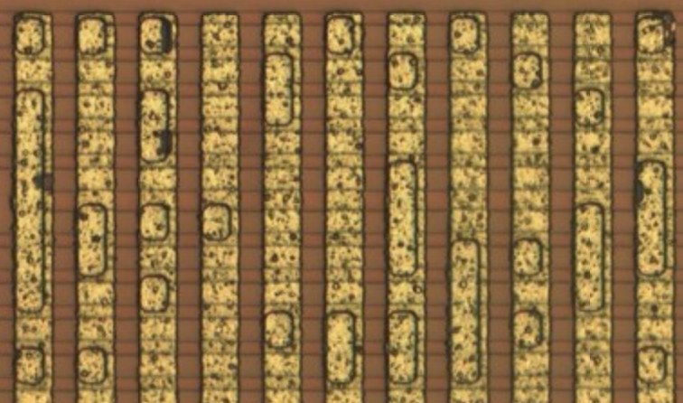

# Decoding the TMS0801 ROM

The TMS0801, from 1974, was one of the first chips to completely contain everything to need to run a calculator.

It contained the CPU, RAM, and ROM, all on one chip.

Inspired by [Ken Shirriff](http://files.righto.com/calculator/sinclair_scientific_simulator.html) reading from a similar chip, I decided to try and see I can read the ROM data by optically copying it off the chip directly.

Following [this patent](https://patents.google.com/patent/US3934233) I already had an idea of the ROM contents already. I found John McMaster had decapped and [imaged the chip in great detail](https://siliconpr0n.org/map/ti/tms0801nc/mcmaster_mz_mit20x/), so I thought, this shouldn't be hard, right?

First, reading through the patent, I can divide the chip into sections:

Here is the ROM:

Here is what the ROM looks like close up:

The rectangles on top of the metal are transistors. Containing or lacking a transistor, reveals the 1s and 0s of the data.

The ROM chip is looks like a 64x60 grid of data. That's our first problem. You see, there are supposed to be 3520 bits of data total, but 64 &times; 60 = 3840 bits.

Upon closer inspection, I realized every 11th row is empty:
