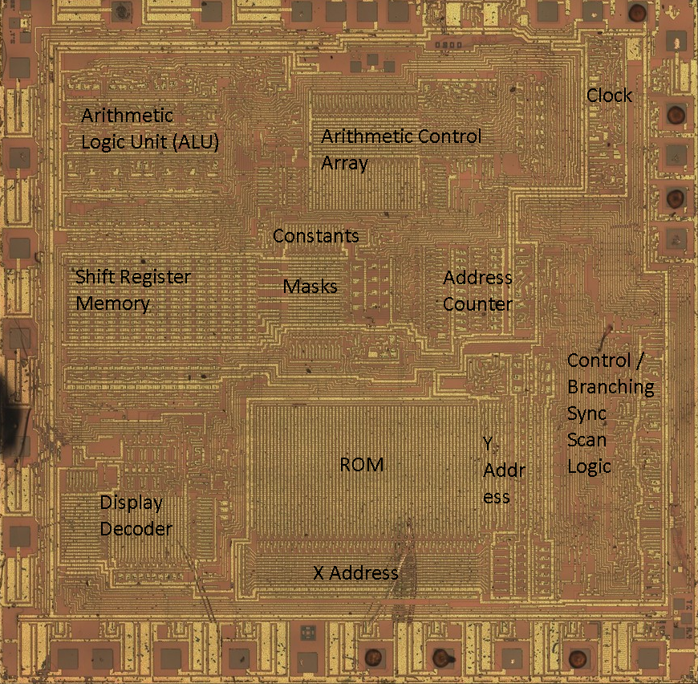
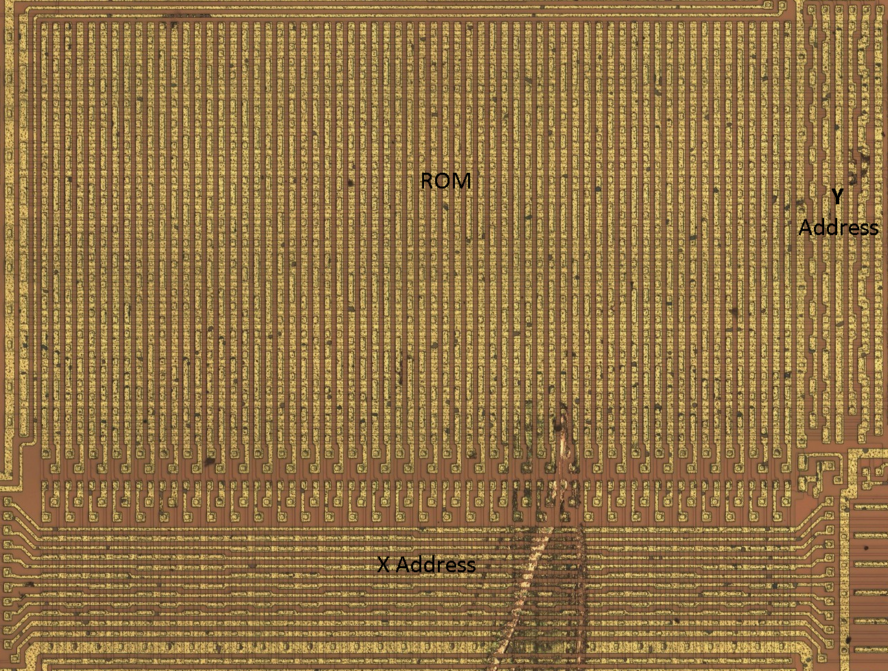
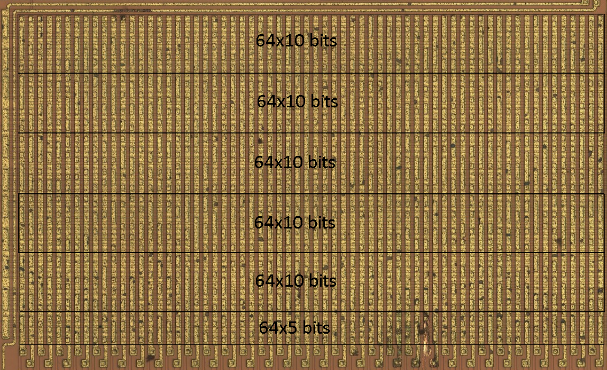
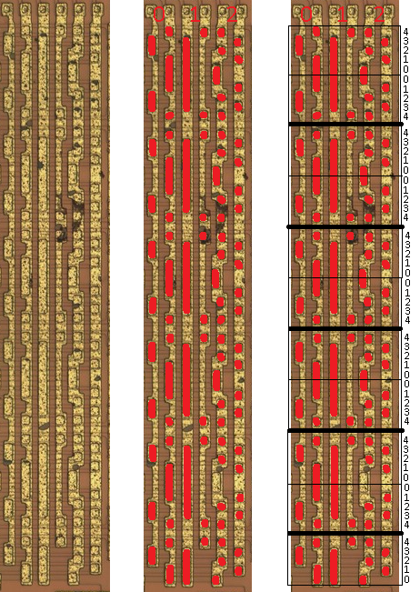
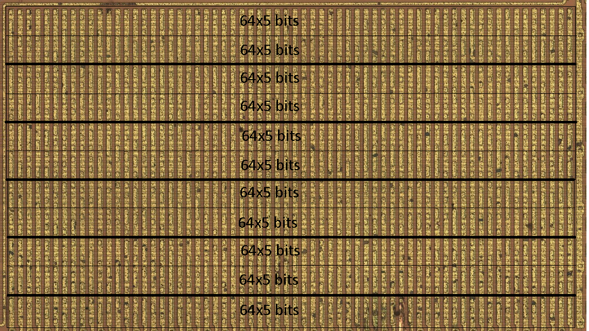

# Decoding the TMS0801 ROM

The TMS0801, from 1972, was one of the first chips to completely contain everything to need to run a calculator. It was used to power the [Sinclair Cambridge](https://en.wikipedia.org/wiki/Sinclair_Cambridge).

It contained the CPU, RAM, and ROM, all on one chip.

Inspired by [Ken Shirriff](http://files.righto.com/calculator/sinclair_scientific_simulator.html) reading from a similar chip, I decided to try and see I can read the ROM data by optically copying it off the chip directly.

Following [this patent](https://patents.google.com/patent/US3934233) I already had an idea of the ROM contents already. I found John McMaster had decapped and [imaged the chip in great detail](https://siliconpr0n.org/map/ti/tms0801nc/mcmaster_mz_mit20x/), so I thought, this shouldn't be hard, right?

## Finding the ROM

Reading through the patent, I can divide the chip into sections:

Here is the ROM:

Here is what the ROM bits look like close up:

The rectangles on top of the metal are transistors. Containing or lacking a transistor, reveals the 1s and 0s of the data.

## Finding the bits

So now, how can we read this data? Does it start on the left or right side? Bottom or top? Do I read it horizontally or vertically?

This chip is actually unusual because rather than using 8 bit bytes, each instruction was 11 bits long. Reading from the patent, the very first instruction is supposed to be:

    10110001111

With no better ideas, I decided to try and just look on the top, bottom, left, and right sides of the ROM to see if I can find that pattern of 1s and 0s. I also tried reading it backwards, or inverting the 0s and 1s.

Despite my efforts, I was not able to find this pattern. It was also a bit disheartening, realizing 11 bits of instructions actually didn't seem to fit neatly within the grid.

## Checking the total bits

I manually counted how many of these little rectangles can fit per column and row.

The ROM chip looks like a 64x60 grid of data. That's our first problem. You see, there are supposed to be 3520 bits of data total, but 64 &times; 60 = 3840 bits.

Upon closer inspection, I realized every 11th row is empty. So the ROM can be divided into slices every 10th row:

Ok, now we have a 64x55 grid of data, which is great, because 64 &times; 55 = 3520 bits.

Also, 55 divides 11 bits evenly. Great! So maybe there are 5 instructions per column!

Unfortunately, even after slicing the rom into these sections, I still couldn't find the first instruction "10110001111" anywhere along the sides of the ROM.

## Ordering of data

Out of ideas, [I asked on reddit](https://old.reddit.com/r/EmuDev/comments/191ompm/how_do_you_read_a_rom_visually_inspecting_the/) to see if they have any ideas how to decode the ROM. [/u/TheThiefMaster](https://old.reddit.com/user/TheThiefMaster) provided some very good insight.

In order to read the ROM, the chip needs to reference any part of it via the x and y axis. The chip does this by having x and y address registers on the sides of the ROM. Here is the X address register:

It might be a bit hard to see, so here I have highlighted the transistors:

Here the first big clue. They divided up each address bit into 2. This way, 6 bits can neatly divide into 2^6 = 64 bits of space. Awesome! With this even division, we would expect this data to be in order.

Perhaps it is different for the y axis?

The y axis looks a bit different from the x axis. After highlighting the transistors, I found a pattern. Dividing it up into equal slices revealed 11 equal pieces.

This further seems to reveal how the bits are ordered. Unlike the x axis, the y axis divides the bits into chunks of 5. Every other chunk is in reverse order.

Let's divide up the ROM with this information:

Perhaps this is how we can decode the ROM?

## Decoding the first word

I attempted to find the first word on either sides:

    10110001111

After a bit of trial and error, following the above patterns, I finally discovered the word on the right side.

This 01001110000 is the exact inverse of the word we are looking for! We got it!

## Conclusion

I checked a few more words.

In case you are wondering, the second word is:

    10101111111

I found it the same way as the first, in the same y positions, but the x address shifted over 1 to the left.

The very last word is:

    00000000000

As we'd expect, I found it on the very right side, with the y positions where I marked 4.

I presume after we reach the left most column, then we restart back at the right column and adjust the y positions according to the pattern found earlier.

Figuring out how to decode this ROM was quite tedius. It makes me respect people who do this kind of thing all the time.

I look forward to emulating this chip some time soon.
